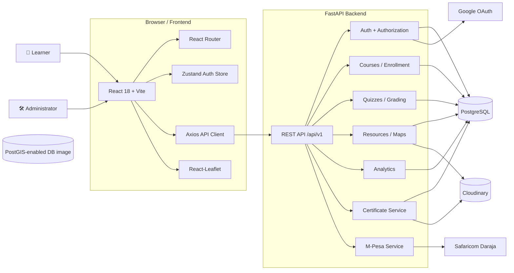
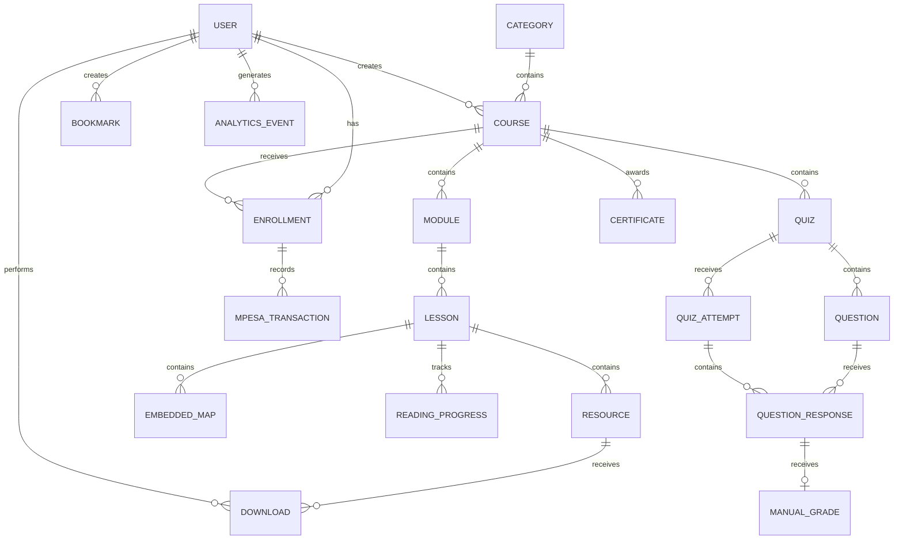
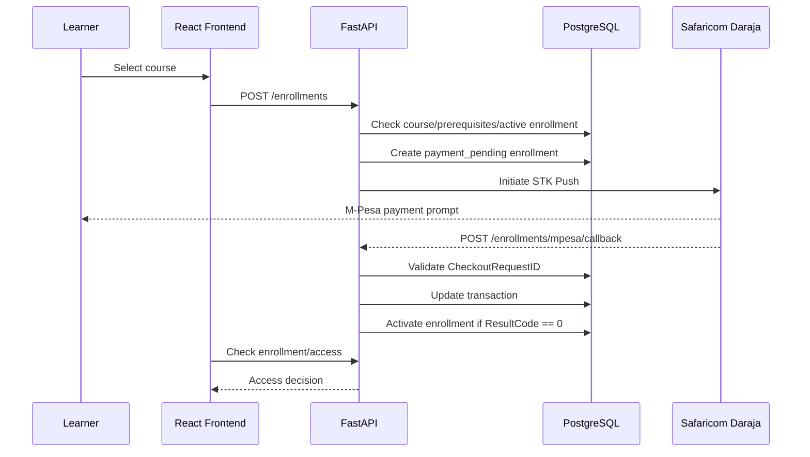
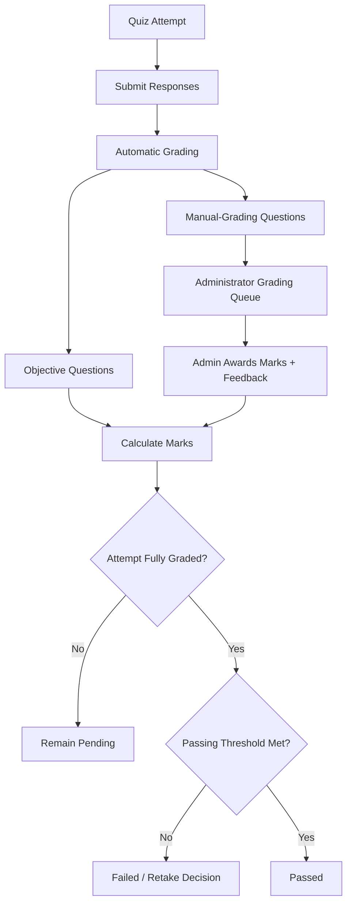
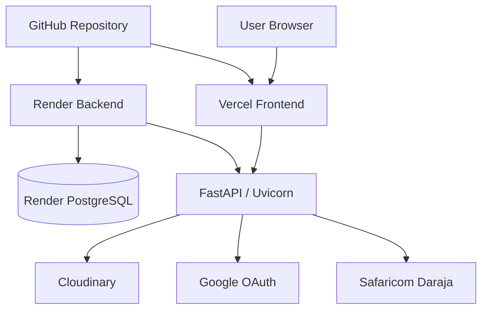

# 🌍 GeoPsy Learning Platform

> **GIS capacity building for tertiary institutions across Kenya.**

GeoPsy Learning Platform is a full-stack, web-based learning platform designed around geospatial education. The repository implements a React/Vite frontend and a Python/FastAPI backend backed by PostgreSQL, with PostGIS supplied in the development database image. The application combines structured GIS courses, protected lesson content, learning progress, assessments, manual grading, certificates, discussion forums, resources, maps, analytics, authentication, and M-Pesa-based paid-course enrollment.

**Current repository state:** The codebase contains a substantial working application architecture, including learner and administrator flows, database models, API routers, payment integration, assessment/grading services, certificate generation, Docker-based local development, automated CI checks, and Render/Vercel deployment configuration. Some production/deployment details remain configuration-dependent and should not be interpreted as proof of a fully operational production environment.

---

## Table of Contents

- [1. Project Overview](#1-project-overview)
- [2. Problem Statement](#2-problem-statement)
- [3. Objectives](#3-objectives)
- [4. Key Features](#4-key-features)
- [5. System Architecture](#5-system-architecture)
- [6. Technology Stack](#6-technology-stack)
- [7. Application Architecture](#7-application-architecture)
- [8. Frontend Architecture](#8-frontend-architecture)
- [9. Backend Architecture](#9-backend-architecture)
- [10. Database Architecture](#10-database-architecture)
- [11. Authentication and Authorization](#11-authentication-and-authorization)
- [12. Course Architecture](#12-course-architecture)
- [13. Enrollment, Payment and Access Control](#13-enrollment-payment-and-access-control)
- [14. Course Progression and Prerequisites](#14-course-progression-and-prerequisites)
- [15. One-Active-Course Rule](#15-one-active-course-rule)
- [16. Quiz, Assessment and Grading System](#16-quiz-assessment-and-grading-system)
- [17. Course Completion and Certification](#17-course-completion-and-certification)
- [18. Resource Management](#18-resource-management)
- [19. Forum / Community Architecture](#19-forum--community-architecture)
- [20. Analytics](#20-analytics)
- [21. Maps and Geospatial Content](#21-maps-and-geospatial-content)
- [22. API Architecture](#22-api-architecture)
- [23. Project Directory Structure](#23-project-directory-structure)
- [24. Local Development Setup](#24-local-development-setup)
- [25. Environment Variables](#25-environment-variables)
- [26. Docker Development Workflow](#26-docker-development-workflow)
- [27. Database Migrations and Seeding](#27-database-migrations-and-seeding)
- [28. Testing](#28-testing)
- [29. Code Quality and CI](#29-code-quality-and-ci)
- [30. Deployment Architecture](#30-deployment-architecture)
- [31. Security Considerations](#31-security-considerations)
- [32. Performance and Low-Bandwidth Considerations](#32-performance-and-low-bandwidth-considerations)
- [33. Contribution Guidelines](#33-contribution-guidelines)
- [34. Future Roadmap](#34-future-roadmap)
- [35. Implementation Audit Notes](#35-implementation-audit-notes)
- [36. License](#36-license)

---

# 1. Project Overview

GeoPsy Learning Platform is a GIS-focused learning management system intended to support geospatial capacity building for tertiary institutions in Kenya.

The implementation follows a client/server architecture:

- **React 18 + Vite** provides the browser application.
- **FastAPI** exposes the versioned REST API.
- **SQLAlchemy** provides the ORM/database abstraction.
- **PostgreSQL** stores application data.
- **PostGIS** is used as the development database image; the current application models primarily represent embedded map geometry as JSON rather than using explicit PostGIS geometry columns.
- **Cloudinary** is used for uploaded media/files and certificate PDF storage.
- **Google OAuth 2.0** is implemented alongside password authentication.
- **Safaricom Daraja/M-Pesa** is integrated into the course enrollment/payment workflow.
- **Leaflet / React-Leaflet** supports interactive map presentation.
- **Zustand** manages frontend authentication state.
- **Docker Compose** provides a reproducible local development stack.

The repository is structured as a monorepo containing separate `frontend` and `backend` applications plus shared development/deployment configuration.

---

# 2. Problem Statement

GeoPsy Learning Platform is designed around a capacity-building problem: learners in tertiary institutions need accessible, structured geospatial learning material that combines theoretical content with GIS-oriented practical resources and assessments.

The platform therefore goes beyond a static collection of course pages. Its implementation models:

- courses, modules and lessons;
- gated lesson content;
- GIS-oriented resources and datasets;
- embedded maps;
- learner enrollment and progression;
- quizzes and multiple assessment types;
- automatic and manual grading;
- certificates;
- discussion forums;
- learner activity and administrative analytics;
- authentication and role-based access;
- paid course enrollment through M-Pesa.

---

# 3. Objectives

## Implemented objectives

The repository provides implementation for:

- authenticated learner and administrator accounts;
- course catalogue and course detail pages;
- course/module/lesson content management;
- protected learner content;
- course enrollment;
- free and paid courses;
- M-Pesa STK Push payment initiation and callback processing;
- prerequisite enforcement;
- one-active-enrollment enforcement;
- learner progress tracking;
- quizzes and quiz attempts;
- automatic grading for objective question types;
- manual grading for non-objective question types;
- certificate generation and verification;
- GIS-oriented resources;
- embedded maps;
- discussion forums;
- bookmarks;
- administrative analytics;
- Cloudinary-backed file storage;
- Docker-based development;

---

# 4. Key Features

| Feature | Implementation status | Main implementation area |
|---|---|---|
| User registration/login | Implemented | `backend/app/api/v1/routers/auth.py` |
| Password authentication | Implemented | `backend/app/core/security.py` |
| Google OAuth 2.0 | Implemented | `backend/app/api/v1/routers/auth.py` |
| JWT access/refresh tokens | Implemented | `backend/app/core/security.py` |
| Learner dashboard | Implemented | `frontend/src/pages/student/` |
| Admin dashboard | Implemented | `frontend/src/pages/admin/` |
| Course catalogue | Implemented | `courses.py` + public course pages |
| Course/module/lesson hierarchy | Implemented | `models/course.py` |
| Course prerequisites | Implemented | `enrollment.py` |
| Course difficulty | Implemented | `Course.difficulty` |
| Course progression order | Implemented | `Course.order_index` |
| Free/paid courses | Implemented | `Course.price` |
| M-Pesa enrollment payment | Implemented | `services/mpesa.py`, enrollment router |
| Payment callback | Implemented | `/enrollments/mpesa/callback` |
| Protected course access | Implemented | enrollment/access checks |
| One active enrollment | Implemented | enrollment router |
| Retake handling | Implemented | enrollment/grading logic |
| Lesson reading progress | Implemented | `ReadingProgress` + progress APIs |
| Bookmarks | Implemented | `Bookmark` + users APIs |
| Resources | Implemented | resource router/model |
| GIS datasets/resource metadata | Implemented | resource model |
| Embedded maps | Implemented | `EmbeddedMap` + maps router |
| Forums/posts/comments | Implemented | forum model/router |
| Quiz creation/management | Implemented | quiz router/admin UI |
| Quiz attempts | Implemented | `quiz_attempts.py` |
| Automatic grading | Implemented | `grading_engine.py` |
| Manual grading queue | Implemented | `grading.py` |
| Certificates | Implemented | certificate service/router |
| Certificate verification | Implemented | verification endpoint/page |
| Analytics | Implemented | analytics model/router/admin UI |
| Cloudinary storage | Implemented | `utils/cloudinary.py` |
| Docker development | Implemented | `docker-compose.yml` |
| Backend tests | Implemented | `backend/tests/` |
| GitHub Actions CI | Implemented | `.github/workflows/ci.yml` |
| Vercel/Render configuration | Present | `render.yaml`, frontend deployment config |

---

# 5. System Architecture



### Component responsibilities

**Frontend**

Responsible for routing, presentation, forms, learner/admin interfaces, client-side authentication state, API communication, map presentation, and user feedback.

**FastAPI backend**

Provides the application boundary. It handles request validation, authentication/authorization, domain rules, persistence, integrations, assessment processing, and certificate orchestration.

**PostgreSQL**

Stores users, courses, lessons, resources, enrollments, transactions, quizzes, attempts, forum content, analytics events, certificates, and related entities.

**Cloudinary**

Provides external storage for uploaded files and generated certificate PDFs.

**Daraja**

Handles M-Pesa STK Push payment initiation and asynchronous payment callbacks.

**Google**

Provides OAuth 2.0 identity authentication.

---

# 6. Technology Stack

| Layer | Technology | Purpose |
|---|---|---|
| Frontend | React 18 | UI application |
| Build tool | Vite | Frontend development/build |
| Styling | TailwindCSS | Utility-based styling |
| Routing | React Router 6 | Client-side routing |
| State | Zustand | Authentication/application state |
| API client | Axios | HTTP communication |
| Maps | Leaflet + React-Leaflet | Interactive maps |
| Charts | Recharts | Analytics visualization |
| Rich text | TipTap | Rich-content editing |
| Sanitization | DOMPurify | Client-side HTML sanitization |
| Backend | Python 3.12 | Application runtime |
| API | FastAPI | REST API |
| ORM | SQLAlchemy | Database access |
| Validation | Pydantic | API schemas/configuration |
| Database | PostgreSQL 15 | Relational persistence |
| Spatial database image | PostGIS 15-3.3 | GIS-capable PostgreSQL environment |
| Authentication | JWT + bcrypt + Google OAuth | Identity/security |
| Payments | Safaricom Daraja/M-Pesa | Paid-course enrollment |
| File storage | Cloudinary | Files/media/certificate PDFs |
| Migrations | Alembic | Database schema migrations |
| Backend testing | pytest | Automated tests |
| Frontend linting | ESLint | Static code quality |
| Containers | Docker / Docker Compose | Local development |
| CI | GitHub Actions | Automated tests/build |
| Frontend deployment | Vercel configuration | Web deployment target |
| Backend deployment | Render configuration | API deployment target |

---

# 7. Application Architecture

The repository uses a conventional layered full-stack structure.

## Frontend

```text
frontend/
└── src/
    ├── components/
    │   ├── admin/
    │   ├── courses/
    │   ├── editor/
    │   ├── layout/
    │   ├── maps/
    │   └── ui/
    ├── pages/
    │   ├── admin/
    │   ├── auth/
    │   ├── public/
    │   └── student/
    ├── router/
    ├── services/
    ├── store/
    ├── assets/
    ├── App.jsx
    ├── main.jsx
    └── index.css
```

## Backend

```text
backend/
└── app/
    ├── api/
    │   └── v1/
    │       └── routers/
    ├── core/
    ├── db/
    ├── models/
    ├── schemas/
    ├── services/
    ├── utils/
    └── main.py
```

The separation between routers, schemas, models and services gives the backend distinct locations for transport/API concerns, validation contracts, persistence models, and domain/integration logic.

---

# 8. Frontend Architecture

The frontend is a React 18 single-page application built with Vite.

## Routing

`frontend/src/router/AppRouter.jsx` defines public, authenticated learner, and administrator routes.

Public routes include:

- `/`
- `/about`
- `/courses`
- `/courses/:slug`
- `/lessons/:id`
- `/forums`
- `/forums/:forumId`
- `/forums/:forumId/posts/:postId`
- `/contact`
- `/verify/:verificationId`

Authentication routes:

- `/login`
- `/register`

Learner routes include:

- `/dashboard`
- `/profile`
- `/bookmarks`
- `/progress`
- `/my-quizzes`
- `/quiz/:quizId`
- `/enroll/:slug`

Administrator routes include:

- `/admin`
- `/admin/courses`
- `/admin/courses/:courseId`
- `/admin/upload`
- `/admin/forums`
- `/admin/analytics`
- `/admin/maps`
- `/admin/quizzes`
- `/admin/quizzes/:quizId`
- `/admin/grading`

The router uses React lazy loading and `Suspense` for route-level code splitting/loading behavior.

## Route protection

Two frontend guards are implemented:

- `RequireAuth` redirects unauthenticated users to `/login`.
- `RequireAdmin` redirects unauthenticated users to `/login` and authenticated non-admin users to `/dashboard`.

These are usability/access-routing controls. Backend authorization remains the security boundary.

## API communication

`frontend/src/services/api.js` creates an Axios client with:

- configurable `VITE_API_URL`;
- a 30-second timeout;
- automatic Bearer-token attachment;
- automatic refresh-token handling after a `401`;
- local token cleanup and redirect to `/login` if refresh fails.

The service module groups API calls by domain: authentication, courses, forums, users, analytics, resources, maps, quizzes, attempts, grading, certificates, enrollment, and extended course administration.

## State management

Zustand is used for the authentication store. The store initializes the current user from the stored access token, performs login/registration, refreshes the user profile, and clears authentication state on logout.

## UI architecture

The component tree is separated into domain-oriented groups for administration, courses, content editing, layout, maps and reusable UI elements.

---

# 9. Backend Architecture

The FastAPI application is initialized in:

```text
backend/app/main.py
```

The application:

1. creates a FastAPI application;
2. configures CORS;
3. installs SlowAPI rate-limiting infrastructure;
4. includes the versioned API router under `/api/v1`;
5. exposes `/api/health`;
6. exposes Swagger at `/api/docs`;
7. exposes ReDoc at `/api/redoc`;
8. initializes database tables and seed data during application lifespan startup.

The API is organized into routers:

```text
backend/app/api/v1/routers/
├── analytics.py
├── auth.py
├── certificates.py
├── courses.py
├── enrollment.py
├── forums.py
├── grading.py
├── maps.py
├── password_reset_patch.py
├── quiz_attempts.py
├── quizzes.py
├── resources.py
└── users.py
```

Supporting layers include:

- `core/` — configuration, security and dependencies;
- `db/` — database base/session/initialization;
- `models/` — SQLAlchemy persistence models;
- `schemas/` — Pydantic request/response models;
- `services/` — payment, grading, progress and certificate business services;
- `utils/` — Cloudinary, email and date utilities.

---

# 10. Database Architecture

The application uses SQLAlchemy ORM models and Alembic migrations.

## Main entities

The repository defines entities for:

- users;
- categories;
- courses;
- modules;
- lessons;
- resources;
- embedded maps;
- enrollments;
- M-Pesa transactions;
- quizzes;
- questions;
- quiz attempts;
- question responses;
- manual grades;
- certificates;
- certificate templates;
- forum content;
- bookmarks;
- reading progress;
- downloads;
- analytics events.

## Course/content relationships



## Course model

A `Course` contains:

- title;
- unique slug;
- description;
- category;
- difficulty;
- thumbnail;
- publication state;
- price;
- order/progression index;
- optional prerequisite;
- maximum retakes;
- creator;
- timestamps.

A course contains ordered modules; each module contains ordered lessons.

## Spatial data

The Docker database uses the `postgis/postgis:15-3.3` image. The current application model does not expose explicit PostGIS `geometry`/`geography` columns in the inspected course/map models. Embedded maps instead store GeoJSON and map display parameters (`center_lat`, `center_lng`, `zoom_level`, `basemap`) as application data.

---

# 11. Authentication and Authorization

## Password authentication

Registration creates users with:

```text
role = "student"
```

Passwords are hashed using Passlib's bcrypt context.

Login verifies the supplied password and returns:

- access token;
- refresh token.

## JWT

The backend creates:

- short-lived access tokens;
- longer-lived refresh tokens.

The access token includes the user ID, role, expiration and token type.

Configured defaults are:

- access token: 30 minutes;
- refresh token: 7 days.

These values are configuration and should be reviewed for production requirements.

## Google OAuth

The backend implements:

```text
GET /api/v1/auth/google
GET /api/v1/auth/google/callback
```

The callback exchanges the authorization code with Google, retrieves the user's profile, creates/updates the user record, and returns the application's JWT tokens.

## Roles

The `User` model currently defines:

```text
student
admin
```

Administrator-only backend endpoints use the `require_admin` dependency.

```text
Frontend route guard
        ↓
User experience / navigation control

Backend dependency + role check
        ↓
Actual authorization boundary
```

---

# 12. Course Architecture

The core learning hierarchy is:

```text
Course
  └── Module
       └── Lesson
            ├── Resource
            ├── Embedded Map
            └── Reading Progress
```

A lesson stores:

- full content;
- public preview content;
- gating state;
- ordering;
- resources;
- embedded maps;
- learner reading progress.

A course can additionally have:

- quizzes;
- prerequisites;
- a price;
- difficulty;
- a progression/order index;
- retake configuration.

Course listing supports:

- pagination;
- title search;
- category filtering;
- difficulty filtering.

Non-admin users receive published courses from the catalogue.

---

# 13. Enrollment, Payment and Access Control

Enrollment is one of the most explicitly implemented business workflows in the platform.

## Enrollment state model

```text
NOT_ENROLLED
      │
      ▼
PAYMENT_PENDING ── payment failure/cancellation ──► retry/new transaction
      │
      │ successful validated callback
      ▼
ENROLLED
      │
      ▼
IN_PROGRESS
      │
      ├──────────────► FAILED ──► RETAKE_ALLOWED
      │
      ▼
PASSED
      │
      ▼
COMPLETED
```

## Free course

For a course with:

```text
price <= 0
```

the backend creates the enrollment immediately with status:

```text
enrolled
```

## Paid course

For a paid course:

1. the backend creates a `payment_pending` enrollment;
2. the backend requires a phone number;
3. the backend initiates an M-Pesa STK Push;
4. Daraja returns a `CheckoutRequestID` and `MerchantRequestID`;
5. those identifiers are stored in `MpesaTransaction`;
6. the learner completes the payment on the phone;
7. Safaricom calls the callback endpoint;
8. the backend validates the callback against the stored checkout request;
9. the transaction is updated;
10. the enrollment is activated only for a successful validated transaction.

### Payment architecture



## Duplicate enrollment prevention

The backend prevents duplicate active/payment-pending enrollment for the same course.

## Access control

The access-check endpoint considers these statuses as providing access:

```text
enrolled
in_progress
passed
completed
```

This means course access is determined server-side rather than solely by frontend route state.

## One-active-course enforcement

The backend blocks enrollment into another course when the learner already has an active enrollment in a different course.

---

# 14. Course Progression and Prerequisites

The platform represents course sequencing through:

```text
Course.order_index
```

and represents explicit prerequisites through:

```text
Course.prerequisite_id
```

The important implementation distinction is:

- **difficulty** describes course level (`beginner`, `intermediate`, `advanced`);
- **order_index** represents course ordering/progression;
- **prerequisite_id** represents an actual prerequisite relationship;
- **enrollment status** determines the learner's current course lifecycle.

The backend explicitly checks prerequisites before creating an enrollment.

If a prerequisite exists and has not been completed, enrollment is rejected.

---

# 15. One-Active-Course Rule

The backend implements a one-active-course rule.

Active statuses are:

```text
enrolled
in_progress
retake_allowed
```

Before starting another enrollment, the backend checks for an existing active enrollment.

If the learner is actively enrolled in a different course, the API returns a conflict and requires the learner to complete or withdraw from the existing course before enrolling in another.

`payment_pending` is deliberately excluded from the active-course blocking query because pending payment attempts can time out.

---

# 16. Quiz, Assessment and Grading System

The assessment subsystem is significantly more capable than a basic multiple-choice quiz engine.

## Quiz configuration

A quiz supports:

- course/module/lesson association;
- category;
- difficulty;
- draft/published/archived states;
- opening and closing times;
- time limits;
- maximum attempts;
- passing percentage;
- total marks;
- question randomization;
- answer randomization.

## Supported question types

The model defines:

- `multiple_choice`
- `multiple_select`
- `true_false`
- `fill_blank`
- `matching`
- `short_answer`
- `essay`
- `gis_workflow`
- `python_code`
- `r_code`
- `file_upload`
- `map_design`

This is particularly relevant to a GIS learning platform because the model explicitly accommodates GIS workflows, map design, code, file submissions and other practical assessment forms.

## Automatic grading

The current automatic grading engine supports:

- multiple choice;
- multiple select;
- true/false;
- fill-in-the-blank;
- matching.

It also supports configured:

- negative marking;
- partial credit for applicable question types.

Non-objective question types are routed to manual grading.

## Manual grading

Administrators can access a grading queue containing responses that require manual grading.

A manual grade stores:

- awarded marks;
- feedback;
- grader;
- grading timestamp.

The backend validates that awarded marks do not exceed the question's maximum marks.

## Assessment architecture



---

# 17. Course Completion and Certification

Certificate issuance is tied to a fully graded and passing quiz attempt.

The certificate service:

1. verifies the attempt has passed;
2. prevents duplicate certificate issuance for the same attempt;
3. resolves the course and learner;
4. resolves an optional certificate template;
5. generates a certificate number;
6. creates the certificate record;
7. generates a PDF;
8. uploads the PDF to Cloudinary;
9. persists the certificate.

Certificate data includes:

- learner name;
- course name;
- competency achieved;
- certification level;
- final score percentage;
- certificate number;
- verification ID;
- issue date;
- PDF URL where upload succeeds.

Certificates can be verified through a public verification route.

---

# 18. Resource Management

Resources belong to lessons.

The resource model supports a broad GIS-oriented type vocabulary, including:

```text
pdf
geojson
pptx
link
image
dataset
video
zip
python
r_script
notebook
markdown
sql
shapefile
geopackage
raster
code_snippet
```

Resource metadata can include:

- file URL;
- external URL;
- file size;
- download count;
- programming language;
- inline code content;
- JSON metadata.

GIS dataset metadata can therefore store additional information such as CRS or feature counts.

## Storage

Uploaded resources are handled through the Cloudinary utility layer.

## Downloads

Authenticated users can request a resource download.

The download endpoint:

1. verifies the resource exists;
2. increments `download_count`;
3. creates a `Download` analytics record;
4. returns the stored file/external URL.

---

# 19. Forum / Community Architecture

The platform includes discussion functionality.

The frontend exposes:

- forum listing;
- forum post lists;
- individual discussion threads.

The API supports operations including:

- forum listing/creation;
- post listing;
- post retrieval;
- post creation;
- comments;
- post pinning;
- post deletion;
- comment deletion.

Administrator forum management is exposed through the admin interface.

---

# 20. Analytics

Analytics are represented through dedicated database models and API endpoints.

The repository records events such as:

```text
course_view
lesson_view
search
```

Other analytics entities include:

- bookmarks;
- reading progress;
- resource downloads.

The frontend/API also exposes administrative analytics for:

- overall platform overview;
- courses;
- students;
- individual student detail;
- student quiz history;
- institutions;
- certificates;
- payments;
- recent activity;
- trends;
- resources.

The analytics overview model includes:

- total students;
- total courses;
- total resources;
- total downloads;
- popular courses;
- top institutions;
- recent downloads.

The platform therefore supports both event collection and administrative aggregation.

---

# 21. Maps and Geospatial Content

The platform includes a dedicated maps router and React-Leaflet/Leaflet frontend dependencies.

An `EmbeddedMap` belongs to a lesson and stores:

- title;
- GeoJSON data;
- center latitude;
- center longitude;
- zoom level;
- basemap.

This supports embedding GIS-oriented interactive maps directly within lesson content.

The frontend package includes:

```text
leaflet
react-leaflet
```

---

# 22. API Architecture

The API is versioned under:

```text
/api/v1
```

Swagger UI is exposed at:

```text
/api/docs
```

ReDoc is exposed at:

```text
/api/redoc
```

Health checking is exposed at:

```text
/api/health
```

## API groups

| Domain | Router |
|---|---|
| Authentication | `/auth` |
| Courses | `/courses` |
| Enrollment | `/enrollments` |
| Forums | `/forums` |
| Resources | `/resources` |
| Maps | `/maps` |
| Quizzes | `/quizzes` |
| Quiz attempts | `/quiz-attempts` |
| Grading | `/grading` |
| Certificates | `/certificates` |
| Analytics | `/analytics` |
| Users | `/users` |

### Representative endpoints

| Method | Endpoint | Purpose |
|---|---|---|
| POST | `/api/v1/auth/register` | Register learner |
| POST | `/api/v1/auth/login` | Authenticate |
| POST | `/api/v1/auth/refresh` | Refresh JWT |
| GET | `/api/v1/auth/me` | Current user |
| GET | `/api/v1/courses` | Course catalogue |
| GET | `/api/v1/courses/{slug}` | Course detail |
| POST | `/api/v1/enrollments` | Start enrollment/payment |
| GET | `/api/v1/enrollments/my` | Learner enrollments |
| GET | `/api/v1/enrollments/check/{course_id}` | Check course access |
| POST | `/api/v1/enrollments/mpesa/callback` | Daraja callback |
| GET | `/api/v1/quizzes` | Quiz listing |
| POST | `/api/v1/quiz-attempts/quiz/{quiz_id}/start` | Start attempt |
| POST | `/api/v1/quiz-attempts/{attempt_id}/submit` | Submit attempt |
| GET | `/api/v1/grading/queue` | Manual grading queue |
| POST | `/api/v1/grading/responses/{response_id}/grade` | Grade response |
| GET | `/api/v1/certificates/me` | Learner certificates |
| GET | `/api/v1/certificates/verify/{verification_id}` | Verify certificate |
| GET | `/api/v1/analytics/overview` | Analytics overview |

The generated Swagger/OpenAPI documentation remains the authoritative detailed endpoint reference.

---

# 23. Project Directory Structure

```text
Geopsy_Learning_Platform/
├── .github/
│   └── workflows/
│       └── ci.yml
├── backend/
│   ├── alembic/
│   │   ├── versions/
│   │   ├── env.py
│   │   └── script.py.mako
│   ├── app/
│   │   ├── api/
│   │   │   └── v1/
│   │   │       └── routers/
│   │   ├── core/
│   │   ├── db/
│   │   ├── models/
│   │   ├── schemas/
│   │   ├── services/
│   │   ├── utils/
│   │   └── main.py
│   ├── seed/
│   │   ├── courses.py
│   │   ├── enrollments.py
│   │   ├── forums.py
│   │   ├── quizzes.py
│   │   ├── users.py
│   │   └── seed.py
│   ├── static/
│   ├── tests/
│   ├── .env.example
│   ├── Dockerfile
│   ├── alembic.ini
│   ├── pytest.ini
│   └── requirements.txt
├── frontend/
│   ├── public/
│   ├── src/
│   │   ├── assets/
│   │   ├── components/
│   │   ├── pages/
│   │   ├── router/
│   │   ├── services/
│   │   ├── store/
│   │   ├── App.jsx
│   │   ├── index.css
│   │   └── main.jsx
│   ├── .env.example
│   ├── Dockerfile
│   ├── nginx.conf
│   ├── package.json
│   ├── postcss.config.js
│   ├── tailwind.config.js
│   ├── vercel.json
│   └── vite.config.js
├── docker-compose.yml
├── Makefile
├── render.yaml
└── README.md
```

---

# 24. Local Development Setup

## Prerequisites

The repository expects:

- Git
- Docker and Docker Compose
- Node.js 20+
- Python 3.12+

The Makefile provides commands for common development operations.

## Clone

```bash
git clone https://github.com/Maxmacharia/Geopsy_Learning_Platform.git
cd Geopsy_Learning_Platform
```

## Environment configuration

Backend:

```bash
cp backend/.env.example backend/.env
```

Frontend:

```bash
cp frontend/.env.example frontend/.env
```

## Docker development

```bash
make dev
```

or:

```bash
docker compose up -d --build
```

The Docker development stack exposes:

```text
Frontend  → http://localhost:5173
Backend   → http://localhost:8000
API Docs  → http://localhost:8000/api/docs
Database  → localhost:5432
```

## Manual backend

```bash
cd backend

python -m venv venv
source venv/bin/activate
```

Windows:

```powershell
venv\Scripts\activate
```

Install dependencies:

```bash
pip install -r requirements.txt
```

Run migrations:

```bash
alembic upgrade head
```

Start FastAPI:

```bash
uvicorn app.main:app --reload
```

## Manual frontend

```bash
cd frontend
npm install
npm run dev
```

---

# 25. Environment Variables

The following names are defined by the platform's backend configuration and environment templates.

| Variable | Purpose | Required for corresponding integration |
|---|---|---|
| `DATABASE_URL` | PostgreSQL connection string | Yes |
| `SECRET_KEY` | JWT signing secret | Yes |
| `ALGORITHM` | JWT algorithm | Configuration |
| `ACCESS_TOKEN_EXPIRE_MINUTES` | Access-token lifetime | Configuration |
| `REFRESH_TOKEN_EXPIRE_DAYS` | Refresh-token lifetime | Configuration |
| `GOOGLE_CLIENT_ID` | Google OAuth client | Google login |
| `GOOGLE_CLIENT_SECRET` | Google OAuth secret | Google login |
| `GOOGLE_REDIRECT_URI` | OAuth callback URL | Google login |
| `CLOUDINARY_CLOUD_NAME` | Cloudinary account | File storage |
| `CLOUDINARY_API_KEY` | Cloudinary API key | File storage |
| `CLOUDINARY_API_SECRET` | Cloudinary API secret | File storage |
| `SMTP_HOST` | Email server | Email features |
| `SMTP_PORT` | SMTP port | Email features |
| `SMTP_USER` | SMTP username | Email features |
| `SMTP_PASSWORD` | SMTP password | Email features |
| `EMAILS_FROM` | Sender address | Email features |
| `APP_ENV` | Application environment | Configuration |
| `FRONTEND_URL` | Frontend origin | CORS/deployment |
| `BACKEND_CORS_ORIGINS` | Allowed frontend origins | CORS |
| `MPESA_CONSUMER_KEY` | Daraja consumer key | M-Pesa |
| `MPESA_CONSUMER_SECRET` | Daraja consumer secret | M-Pesa |
| `MPESA_SHORTCODE` | Daraja shortcode | M-Pesa |
| `MPESA_PASSKEY` | Daraja passkey | M-Pesa |
| `MPESA_ENV` | `sandbox` or `production` | M-Pesa |
| `MPESA_CALLBACK_URL` | Public callback endpoint | M-Pesa |
| `MPESA_ACCOUNT_REF` | Payment account reference | M-Pesa |
| `MPESA_TRANSACTION_DESC` | Payment description | M-Pesa |
| `VITE_API_URL` | Frontend API base URL | Frontend |

---

# 26. Docker Development Workflow

The root `docker-compose.yml` defines three services:

```text
db
backend
frontend
```

## Database

```text
Image: postgis/postgis:15-3.3
Port: 5432
Volume: pgdata
```

The named volume provides database persistence across normal container restarts.

## Backend

```text
Build: ./backend
Port: 8000
Command: uvicorn app.main:app --host 0.0.0.0 --port 8000 --reload
```

The backend mounts the local `backend` directory into the container for development.

## Frontend

```text
Build: ./frontend
Container port: 80
Host port: 5173
```

The frontend is configured to communicate with:

```text
http://localhost:8000/api/v1
```

## Useful Make commands

```bash
make dev
make backend
make frontend
make install
make migrate
make seed
make test
make lint
make build
make logs
make stop
make reset
```

`make reset` deletes the Docker database volume and recreates the stack. Use it only when intentionally resetting local database state.

---

# 27. Database Migrations and Seeding

Alembic is included under:

```text
backend/alembic/
```

Apply migrations:

```bash
make migrate
```

or:

```bash
cd backend
alembic upgrade head
```

The platform also contains seed modules for:

- users;
- courses;
- enrollments;
- forums;
- quizzes.

The application startup lifecycle calls database initialization/seed logic, and the Makefile provides an explicit `make seed` command.

### Operational consideration

The FastAPI lifespan currently calls:

```python
Base.metadata.create_all(bind=engine)
```

before running the initialization routine.

This means the application has both:

- an Alembic migration system; and
- startup-time SQLAlchemy table creation.

---

# 28. Testing

Backend tests are located under:

```text
backend/tests/
```

Run them with:

```bash
make test
```

or:

```bash
cd backend
pytest tests/ -v
```

The GitHub Actions workflow runs the backend test suite.

The CI workflow also builds the frontend with:

```bash
npm ci
npm run build
```

The current CI backend test job sets:

```text
DATABASE_URL=sqlite:///./test.db
```

---

# 29. Code Quality and CI

## Frontend linting

```bash
make lint
```

runs:

```bash
npm run lint
```

which invokes ESLint over JavaScript/JSX source.

## Frontend build

```bash
make build
```

runs:

```bash
npm run build
```

## GitHub Actions

CI runs on:

- pushes to `main` and `develop`;
- pull requests targeting `main`.

The workflow contains:

### Backend job

- Ubuntu runner;
- Python 3.12;
- pip caching;
- dependency installation;
- pytest.

### Frontend job

- Ubuntu runner;
- Node 20;
- npm dependency installation;
- Vite production build.

---

# 30. Deployment Architecture

The repository contains deployment configuration targeting Vercel and Render.



## Render

`render.yaml` defines:

- a Python web service;
- `backend` as the root directory;
- `pip install -r requirements.txt` as the build command;
- Uvicorn as the start command;
- a Render PostgreSQL database;
- `/api/health` as the health-check path.

## Vercel

The repository contains frontend Vercel configuration and the frontend is designed to be built using:

```bash
npm run build
```

## Production environment

Production deployment requires correctly configured:

- `DATABASE_URL`;
- JWT secret;
- frontend/API origins;
- Google OAuth credentials;
- Cloudinary credentials;
- M-Pesa credentials/callback;
- other required environment variables.

---

# 31. Security Considerations

## Password hashing

Passwords are hashed with bcrypt before persistence.

## JWT

JWT access and refresh tokens are signed with the configured secret and use an explicit algorithm.

## Backend authorization

Administrator-only functionality uses backend dependency checks such as `require_admin`.

Examples include:

- administrative course operations;
- grading;
- analytics;
- enrollment administration;
- certificate administration.

## CORS

CORS is configured through `BACKEND_CORS_ORIGINS`.


## Rate limiting

The FastAPI application initializes SlowAPI rate-limiting infrastructure.

The existing README/configuration documents intended limits for public and authentication traffic.

## Payment callback

The M-Pesa callback is intentionally unauthenticated because Safaricom cannot provide the application's Bearer token.

The platform instead validates the callback using the stored `CheckoutRequestID` associated with the transaction. Enrollment activation is tied to a validated successful Daraja result.

---

# 32. Performance and Low-Bandwidth Considerations

The platform contains several implementation choices relevant to browser and network efficiency:

- Vite production builds;
- React lazy-loaded routes;
- paginated course APIs;
- paginated administrative enrollment APIs;
- API request timeout configuration;
- lightweight REST API communication;
- Cloudinary-backed external file storage;
- responsive React/Tailwind frontend architecture.

The project is positioned as mobile-first and intended for learners in environments where connectivity may be constrained.

---

# 33. License

The repository identifies itself as MIT licensed.

---

## Repository

[GeoPsy Learning Platform on GitHub](https://github.com/Maxmacharia/Geopsy_Learning_Platform)

## Maintainer

Maxmacharia

> Built for GIS learning and capacity building in Kenya.
